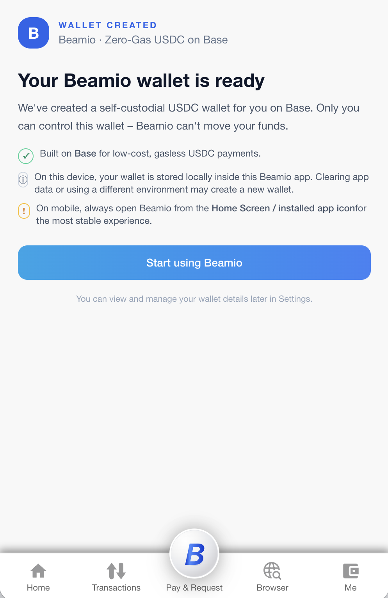

# Beamio Android App (`beamio.app`)


The **Beamio Android App** is the official Android wrapper for the Beamio stablecoin wallet ecosystem (USDC on Base L2).  
It provides a fast, optimized WebView container for `https://beamio.app/app`, enhancing the user experience with native features such as camera access, refined user-agent detection, and Chrome debugging support.

> 🚀 **Goal:** Deliver a frictionless, WeChat-Pay-level experience for stablecoin payments, USD settlement, merchant checkout, and cross-border usage — with zero onboarding friction.

---

## 📸 Preview (Placeholder)




---

## ✨ Features

- 📱 Native Android WebView shell for Beamio PWA  
- 🔒 Full support for IndexedDB, LocalStorage, and PWA behaviors  
- 📷 Camera access for QR scanning and authentication  
- 🎨 Auto light/dark mode support  
- 🧭 Custom User-Agent for reliable environment detection  
- 🧪 Chrome remote debugging (`chrome://inspect`)  
- 🧰 Future-ready architecture (proxy engine, tun2socks, VPN, Web3 integrations)

---

## 📂 Project Structure

```text
app/
  src/
    main/
      java/com/beamio/app/
        MainActivity.kt
        WebViewClientEx.kt
        WebChromeClientEx.kt
      res/
        layout/activity_main.xml
        mipmap/
      AndroidManifest.xml
  build.gradle(.kts)
README.md

